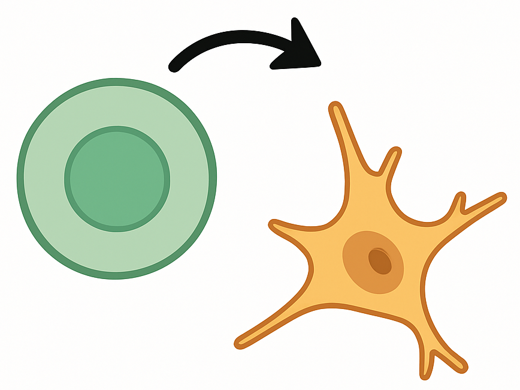
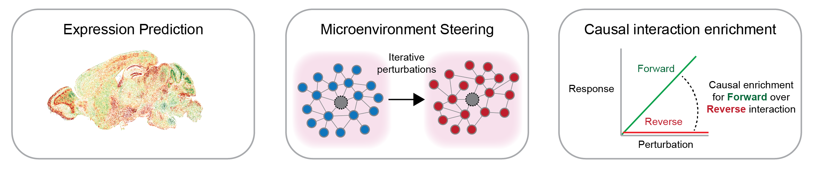

#  SpatialProp: Tissue perturbation modeling with spatially resolved single-cell transcriptomics

**SpatialProp** (Spatial Propagation of Single-cell Perturbations) is a computational framework leveraging graph deep learning to predict the spatial effects of single-cell genetic perturbations using spatially resolved single-cell transcriptomics data.

SpatialProp takes as input a spatially resolved single-cell transcriptomics dataset of intact tissue and a user-defined set of single-cell perturbations represented by their perturbed gene expression profiles. Then, using the core graph neural network module, SpatialProp predicts perturbed gene expression in a cell-by-cell manner and calibrates these predictions for model error to update gene expression profiles for every cell in the tissue. Finally, SpatialProp outputs a prediction of the perturbed gene expression profiles for all cells in the spatially resolved single-cell transcriptomics data, including for cells that did not receive a direct user-specified perturbation.

## Using SpatialProp

To deploy SpatialProp on a new dataset, the following steps need to be taken:
- Train SpatialProp GNN from scratch on a spatially resolved single-cell transcriptomics dataset (e.g. MERFISH, Xenium, Slide-seq, Stereo-seq, STARmap, etc.).
- Specify the single-cell perturbations to make in the tissue.
- SpatialProp makes these perturbations and then uses the GNN along with the calibration framework to predict the perturbed gene expression across the entire tissue section. Training and predicting on different subsets of the data is recommended.
- SpatialProp includes additional utilities to visualize the predicted perturbed gene expression.

Also included are scripts for running a set of evaluation frameworks for SpatialProp (or any spatial perturbation model). These include iterative steering of niches to a target state, and the cell-cell interaction benchmark under CausalInteractionBench: https://github.com/sunericd/CausalInteractionBench

## Installation

To install SpatialProp, run the following from the current directory:

    pip install .

## Training the SpatialProp GNN

We provide an example command to train SpatialProp on the `aging_coronal.h5ad` dataset from https://zenodo.org/records/13883177.

    python scripts/train_gnn_model_expression.py \
        --dataset aging_coronal \
        --base_path path/to/anndata/dir \
        --k_hop 2 \
        --augment_hop 2 \
        --center_celltypes "all" \
        --node_feature "expression" \
        --inject_feature "none" \
        --learning_rate 0.0001 \
        --loss weightedl1 \
        --epochs 50 \
        --do_eval

An optional `--debug` flag can be added for quick testing. Note that the `--do_eval` flag computes Pearson correlation, Spearman correlation, and MAE metrics between predictions and ground truth as reported in the preprint.

## Deploy SpatialProp with a trained GNN: Inflammatory signaling example

For this example, you can access the following dataset at https://zenodo.org/records/13883177. We show use of the lightweight SpatialProp [API](./src/spatial_gnn/api/perturbation_api.py) to deploy a trained SpatialProp model in predicting inflammatory response.

In this example, we perturb pro-inflammatory cytokines IL-6, TNF, and IFN-γ in T cells and microglia of a coronal tissue section of mouse brain. Here the user specifies a dictionary of desired perturbations and multipliers that scale the gene expressions in the desired set of cells. For example, the baseline expression of IL-6 will be multiplied by 10 in both T cells and microglia in this example:

    perturbation_dict = {
        'T cell': {'Il6': 10.0, 'Tnf': 10.0, 'Ifng': 10.0},    
        'Microglia': {'Il6': 10.0, 'Tnf': 10.0, 'Ifng': 10.0},          
    }

Then we can apply these perturbations and compute SpatialProp-predicted effects with the following API calls:

    save_path = create_perturbation_input_matrix(
        adata,
        perturbation_dict,
        save_path=save_path
    )
    adata_result = predict_perturbation_effects(
        save_path,
        trained_model_path,
        exp_name,
        use_ids=test_ids
    )

This will return an updated anndata object with predicted propagated expression that can be accessed as `adata_perturbed.layers['tempered']`. Check out the [notebook example](./notebooks/api_demo.ipynb) for the entire end-to-end training and inference workflow, as well as plotting utilities used in the package.
